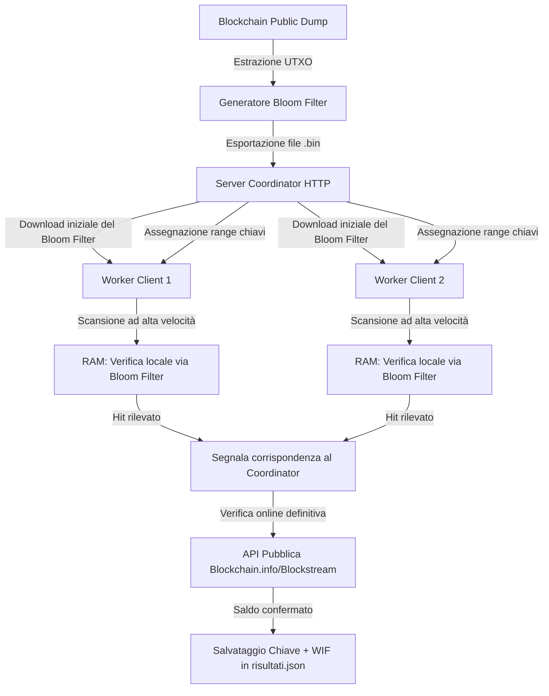

# Progetto HYPERION
## Architettura per la Scansione Crittografica Distribuita Offline di Bitcoin

Benvenuto nel documento delle specifiche di **Progetto HYPERION**. 
Questo progetto ridefinisce l'approccio alla ricerca distribuita di chiavi private Bitcoin con saldo attivo, eliminando il collo di bottiglia della rete e i requisiti di archiviazione massivi (nodi locali, database e indici da centinaia di gigabyte).

---

### 1. Visione d'Insieme dell'Architettura

L'idea cardine di **Hyperion** è lo spostamento della logica di verifica del saldo da **Online (tramite query RPC/Fulcrum)** a **Offline (in memoria locale)**.

---

### 2. Dettaglio Tecnico del Bloom Filter

Un **Bloom Filter** è una struttura dati probabilistica ad altissima efficienza di spazio, ideale per verificare se un elemento appartiene a un insieme. Può dare falsi positivi (dice che un indirizzo ha un saldo quando in realtà è vuoto), ma non dà mai falsi negativi (se dice che non c'è, è garantito al 100% che l'indirizzo ha saldo zero).

#### Calcolo dei requisiti di RAM per 80.000.000 di indirizzi attivi:
Applicando la formula ottimale per la dimensione del filtro in bit \(m\):
\[m = -\frac{n \cdot \ln(p)}{(\ln 2)^2}\]

Dove:
*   \(n = 80.000.000\) (indirizzi Bitcoin attivi stimati)
*   \(p\) = Probabilità di falso positivo desiderata

| Probabilità di Falso Positivo (\(p\)) | Spazio in RAM richiesto | Falsi Positivi attesi |
| :--- | :--- | :--- |
| **0.1% (1 su 1.000)** | **143 MB** | 1 ogni 1.000 chiavi generate |
| **0.01% (1 su 10.000)** | **192 MB** | 1 ogni 10.000 chiavi generate |
| **0.0001% (1 su 1.000.000)** | **288 MB** | 1 ogni 1.000.000 di chiavi generate |

*Nota: Con soli **288 MB di RAM**, possiamo verificare le chiavi localmente con una precisione del 99.9999%! I rari falsi positivi verranno filtrati istantaneamente dal worker eseguendo una singola chiamata a una API pubblica prima di segnalare il match al coordinator.*

---

### 3. Componenti di Progetto

#### A. UTXO Processor & Filter Builder (Offline Utility)
*   **Tecnologia:** Python o Go.
*   **Funzionamento:** Legge un dump del database `chainstate` di Bitcoin Core (o un dump di indirizzi pubblici con saldo), calcola lo `scripthash` per ogni indirizzo e lo inserisce nel Bloom Filter. Esporta infine un file binario compresso (es. `filter.bin` di ~200MB).

#### B. Server Coordinator (HTTP Coordinator)
*   **Tecnologia:** Python (FastAPI / Flask) o Go.
*   **Funzionamento:** 
    *   Gestisce la distribuzione degli intervalli di chiavi private (es. blocchi da 1.000.000 di chiavi).
    *   Ospita e distribuisce il file `filter.bin` ai worker quando si collegano per la prima volta.
    *   Riceve i report di completamento e salva i "veri positivi" in un file centrale `vincite.json`.

#### C. Hyperion Worker Core (C++ / Rust / Go)
*   **Tecnologia:** **Rust** (scelta consigliata per performance crittografiche eccellenti e multithreading puro).
*   **Funzionamento:**
    1.  All'avvio, scarica o carica in RAM il file `filter.bin`.
    2.  Chiede un blocco di chiavi al Coordinator.
    3.  Deriva le chiavi private e i relativi indirizzi (Legacy, Nested, Native) a velocità massima.
    4.  Interroga il Bloom Filter in RAM per ogni indirizzo generato.
    5.  Se c'è un hit, contatta un'API pubblica di verifica. Se il saldo è confermato, invia i dettagli al Coordinator.
    6.  Segnala il completamento del blocco e richiede un nuovo intervallo.

---

### 4. Vantaggi Rispetto all'Architettura Corrente

1.  **Risparmio Spazio (da ~750 GB a < 1 GB)**: Non serve più memorizzare la blockchain e l'indice RocksDB sul computer o sul NAS.
2.  **Velocità Scalabile su GPU**: Rimuovendo i limiti di rete, la derivazione può essere delegata alla GPU (CUDA), permettendo di passare da **900 chiavi/secondo** a **milioni di chiavi/secondo** su singola macchina.
3.  **Configurazione Zero sui Client**: Gli altri computer worker non devono avere database, nodi o credenziali. Devono solo scaricare il filtro di pochi megabyte ed eseguire il calcolo.
4.  **Resilienza di Rete**: Se la connessione internet cade temporaneamente, il worker continua a scansionare offline e accoda i risultati da inviare quando la rete ritorna.

---

### 5. Roadmap di Sviluppo Proposta

*   **Fase 1 (Completata)**: Script di generazione del Bloom Filter a partire da un file CSV/testo di indirizzi attivi (con estrazione payload a 20-byte).
*   **Fase 2 (Completata)**: Riscrittura del Worker Client in **Rust** (CPU bound) con supporto per il Bloom Filter locale.
*   **Fase 3 (Completata)**: Aggiornamento del Server Coordinator per ospitare il file binario del Bloom Filter e gestire blocchi scalabili.
*   **Fase 4 (Completata)**: Integrazione di codice **OpenCL** in Rust per accelerazione cross-platform (NVIDIA/AMD) automatica su GPU, con gestione ottimizzata dei blocchi massivi (50+ milioni di chiavi) e fallback su CPU manuale tramite parametro `--cpu`.
